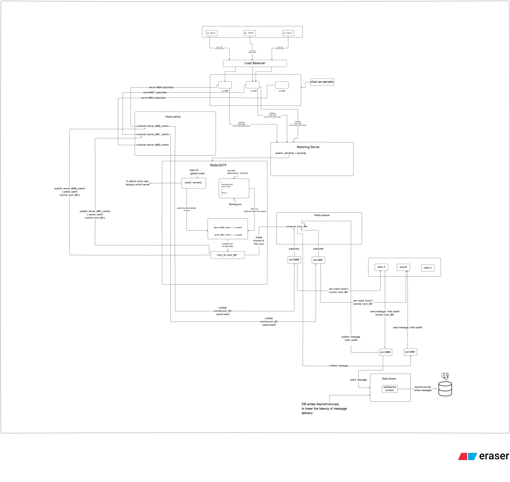

# Distributed Anonymous Real-Time Chat

A highly scalable, real-time anonymous chat application. Built with a Next.js edge-cached frontend and a distributed containerized backend featuring WebSockets, Nginx reverse proxy, load balancing, and Redis Pub/Sub for cross-node communication.

**[View Live Demo](https://anonymous-frontend-three.vercel.app)** | **[ View System Architecture (Eraser.io)](https://app.eraser.io/workspace/SbT5CcxGfQsZ7xDCLFg2?origin=share&elements=utvXblAsjHvhzcIphL0zAQ)**

---

# System Architecture



This project is engineered for high availability and real-time performance. The architecture completely separates the client-side UI delivery from the persistent WebSocket connections:

1. **Frontend Delivery (Edge):** The Next.js frontend is deployed on Vercel, utilizing edge caching for instant load times (`304 Not Modified`).
2. **Reverse Proxy (Nginx):** All real-time traffic is securely routed through a custom cloud domain (`api.tilakraaz.cloud`). Nginx handles SSL/TLS termination (Let's Encrypt) and upgrades standard HTTPS requests into persistent WebSocket TCP streams (`101 Switching Protocols`), keeping sockets alive with custom read/write timeouts.
3. **Load Balancing & Cluster:** Traffic is piped into a Dockerized load balancer that distributes WebSocket connections across a cluster of backend nodes (`node_a`, `node_b`, `node_c`).
4. **State & Messaging (Redis & Postgres):** 
   - **Redis Pub/Sub:** Used for fast message brokering across the distributed nodes so users connected to different servers can seamlessly chat in real-time.
   - **Redis Streams:** Implemented as a highly reliable, append-only event log to manage asynchronous microservice tasks and event dispatching without message loss.
   - **Postgres:** Handles structured, persistent relational data.
5. **Microservices & Matchmaking:** Dedicated `worker` and `matchmaker` containers run in the background. The Matchmaker service queues waiting users using Redis Sorted Sets. Enqueueing and pairing run as a single **Lua script**, so even several matchmaker replicas can never strand a user in the queue or pop the same user twice. The script also skips "ghost" users whose chat node has died.

---

## ✨ Key Features
- **Real-Time WebSockets:** Low-latency, bi-directional communication bypassing standard HTTP overhead.
- **High-Concurrency Matchmaking:** Utilizes Redis Sorted Sets (ZSET) for matchmaking queues, with enqueue + pair done atomically in one Lua script to prevent race conditions across matchmaker replicas.
- **Server-Side Identity:** Session IDs are generated by the server and never sent to browsers; clients only ever see `"me"` or `"stranger"`, so nobody can impersonate or hijack another user.
- **Liveness & Failure Handling:** WebSocket ping/pong heartbeats drop dead connections; route keys carry a TTL refreshed by the heartbeat, so users on a crashed node expire automatically and their chat partners are notified.
- **Reliable Persistence:** The worker creates its own schema, retries pending stream entries after a DB outage, claims entries left behind by a crashed worker (`XAUTOCLAIM`), writes idempotently (`ON CONFLICT`), and dead-letters poison messages.
- **Abuse Protection:** Per-connection rate limiting, message length and frame size limits, and strict packet validation (a malformed packet can no longer crash a node).
- **Proven Scalability (Stress Tested):** 
  - **AWS EC2 (`t3.small`):** Successfully stress-tested with **1,000 concurrent users**, achieving a **92% success rate**.
  - **Local Cluster:** Handled **2,000 concurrent users** flawlessly with a **100% success rate**.
- **Auto-Reconnection Logic:** The frontend aggressively polls and re-establishes dropped connections seamlessly.
- **Distributed Backend:** Containerized cluster architecture capable of scaling horizontally.
- **Secure Infrastructure:** Enforced HTTPS and WSS protocols with strictly managed Nginx proxy pass headers.

---

## 🔌 WebSocket Protocol

**Client → Server**

| Action | Payload | Effect |
| --- | --- | --- |
| `find_match` | `{ "action": "find_match" }` | Join the queue. While chatting, this skips to a new stranger. |
| `cancel_search` | `{ "action": "cancel_search" }` | Leave the queue. |
| `send` | `{ "action": "send", "text": "hi" }` | Send a chat message (max 1000 chars). |
| `typing` | `{ "action": "typing" }` | Show a typing indicator to the partner (not stored). |
| `leave` | `{ "action": "leave" }` | End the current chat. |

**Server → Client**

| Message | Meaning |
| --- | --- |
| `{ "system": true, "action": "searching" \| "matched" \| "partner_left" \| "left" \| "search_cancelled" \| "error", "text": "..." }` | State changes and errors |
| `{ "id": "...", "from": "me" \| "stranger", "text": "...", "ts": 1700000000000 }` | A chat message |
| `{ "action": "typing" }` | The stranger is typing |

---

## 🛠 Technology Stack

**Frontend**
* Next.js
* React
* WebSockets (Native API)
* Vercel (Hosting & Edge Cache)

**Backend & Microservices**
* Node.js 
* WebSockets
* Docker & Docker Compose (Container Orchestration)

**Database & Caching**
* PostgreSQL (Relational Data)
* Redis (Pub/Sub & In-Memory Cache)

**Cloud & DevOps**
* AWS EC2 (Hosting Environment)
* Nginx (Reverse Proxy & Load Balancing)
* Certbot / Let's Encrypt (SSL/TLS Security)
* Custom Domain Routing

---

## 🚀 Local Development Setup

To run this heavily containerized stack locally, you need Docker installed on your machine.

**1. Clone the repository:**
```bash
git clone https://github.com/tilak-raaz/anonymous-chat-app.git
cd anonymous-chat-app
```

**2. Spin up the Backend Cluster:**
```bash
docker compose up --build
```
*(This will boot the load balancer, backend nodes, matchmaker, worker, Redis, and Postgres on your local machine).*

**3. Run the Frontend Locally:**
```bash
git clone https://github.com/tilak-raaz/anonymous-frontend
npm install
npm run dev
```

**4. Backend Environment Variables (optional):**

All settings live in `config.js` and default to the Docker service names. The useful ones: `REDIS_URL`, `MATCHMAKER_URL`, `DB_HOST` / `DB_USER` / `DB_PASSWORD` / `DB_NAME`, `MAX_MESSAGE_LENGTH`, `RATE_LIMIT_MAX`, `RATE_LIMIT_WINDOW_MS`, `HEARTBEAT_INTERVAL_MS`, `ROUTE_TTL_SECONDS`. Set `POSTGRES_PASSWORD` before running `docker compose up` on a real server.

**5. Frontend Environment Variables:**
Ensure your local frontend `.env.local` points to your local Docker proxy:
```env
NEXT_PUBLIC_WS_URL=ws://localhost:8080/
```

---

## 👨‍💻 Author

**Tilak Kumar**
Specializing in Distributed Systems, Cloud Architecture, and High-Concurrency Backend Engineering.
* GitHub: [@tilak-raaz](https://github.com/tilak-raaz)